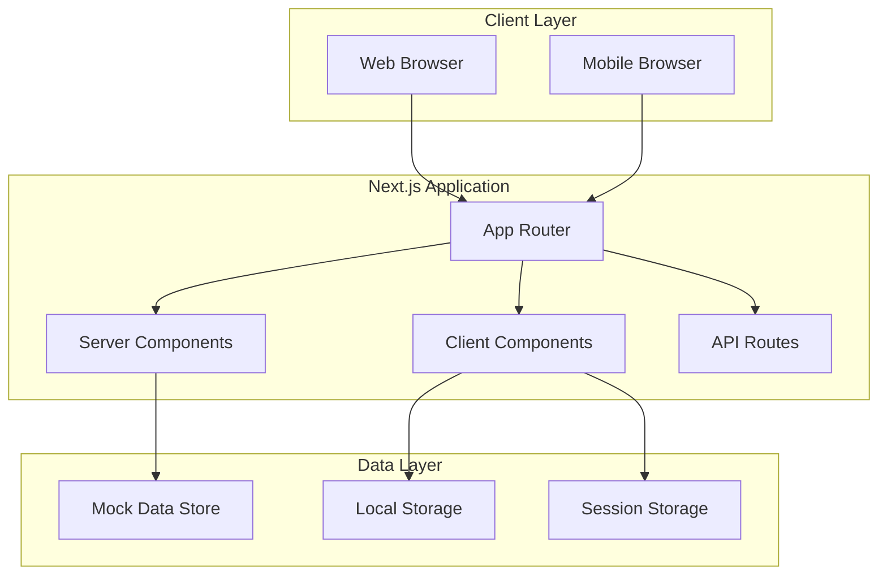

# Design Document: Qavah-mart Computer E-commerce Platform

## Overview

Qavah-mart is a specialized computer e-commerce platform built with Next.js that provides a marketplace for computers and computer accessories. The system follows a modern, component-based architecture with server-side rendering for optimal performance and SEO. The platform features a professional brown and white color scheme and responsive design optimized for desktop, tablet, and mobile devices.

The architecture leverages Next.js 13+ App Router for file-system based routing, React Server Components for improved performance, and a modular component structure that separates concerns between data fetching, business logic, and presentation layers.

## Architecture

### High-Level Architecture



### Technology Stack

- **Frontend Framework**: Next.js 13+ with App Router
- **UI Library**: React 18+ with Server and Client Components
- **Styling**: Tailwind CSS with custom brown/white theme configuration
- **State Management**: React Context API for global state (user, location, cart), useState/useReducer for local component state
- **Data Storage**: Mock JSON data files for initial development, localStorage for user sessions and preferences
- **Image Optimization**: Next.js Image component with automatic optimization and lazy loading
- **Form Handling**: React Hook Form with Zod validation
- **SEO**: Next.js Metadata API, structured data (JSON-LD), and semantic HTML
- **Responsive Design**: Tailwind CSS responsive utilities with mobile-first approach
- **Icons**: Lucide React or Heroicons for consistent iconography

### Color Scheme Configuration

```typescript
// Tailwind theme configuration
const colors = {
  primary: {
    50: '#fdf8f6',
    100: '#f2e8e5',
    200: '#eaddd7',
    300: '#e0cec7',
    400: '#d2bab0',
    500: '#c9a997',  // Main brown
    600: '#b08968',
    700: '#9c6644',
    800: '#7f5539',
    900: '#582f0e',
  },
  neutral: {
    50: '#fafafa',
    100: '#f5f5f5',
    200: '#e5e5e5',
    300: '#d4d4d4',
    400: '#a3a3a3',
    500: '#737373',
    600: '#525252',
    700: '#404040',
    800: '#262626',
    900: '#171717',
  },
  white: '#ffffff',
  brown: {
    light: '#c9a997',
    DEFAULT: '#9c6644',
    dark: '#7f5539',
  }
}
```

### Rendering Strategy

- **Static Generation (SSG)**: Category pages, product listing pages
- **Server-Side Rendering (SSR)**: Product detail pages, search results
- **Client-Side Rendering (CSR)**: Interactive components like filters, cart, user dashboard
- **Incremental Static Regeneration (ISR)**: Product catalog updates

### Routing Structure

```
app/
├── page.tsx                          # Homepage (SSG)
├── layout.tsx                        # Root layout with header/footer
├── search/
│   └── page.tsx                      # Search results (SSR)
├── categories/
│   ├── [category]/
│   │   ├── page.tsx                  # Category page (SSG)
│   │   └── [subcategory]/
│   │       └── page.tsx              # Subcategory page (SSG)
├── products/
│   └── [productId]/
│       └── page.tsx                  # Product detail (SSR)
├── user/
│   ├── login/
│   │   └── page.tsx                  # Login page (CSR)
│   ├── register/
│   │   └── page.tsx                  # Registration page (CSR)
│   ├── profile/
│   │   └── page.tsx                  # User profile (SSR)
│   └── dashboard/
│       └── page.tsx                  # Seller dashboard (SSR)
├── sell/
│   ├── new/
│   │   └── page.tsx                  # Create listing (CSR)
│   └── edit/
│       └── [listingId]/
│           └── page.tsx              # Edit listing (CSR)
└── api/
    ├── products/
    │   └── route.ts                  # Product API endpoints
    ├── search/
    │   └── route.ts                  # Search API endpoints
    ├── users/
    │   └── route.ts                  # User API endpoints
    └── reviews/
        └── route.ts                  # Review API endpoints
```

## Components and Interfaces

### State Management Architecture

The application uses a layered state management approach:

**Global State (React Context)**:
```typescript
interface AppContextState {
  user: User | null;
  location: string | null;
  cart: CartItem[];
  favorites: string[]; // product IDs
  theme: 'light' | 'dark';
}

interface UserContextState {
  user: User | null;
  isAuthenticated: boolean;
  login: (credentials: LoginCredentials) => Promise<void>;
  logout: () => void;
  register: (userData: RegisterData) => Promise<void>;
  updateProfile: (updates: Partial<User>) => Promise<void>;
}

interface LocationContextState {
  currentLocation: string | null;
  availableLocations: Location[];
  setLocation: (location: string) => void;
  clearLocation: () => void;
}
```

**Local Component State**:
- Form inputs and validation states
- UI toggles (modals, dropdowns, accordions)
- Pagination and sorting preferences
- Temporary data before submission

**Server State (via API Routes)**:
- Product catalog data
- User profiles and listings
- Reviews and ratings
- Search results

### Core Layout Components

#### Header Component
```typescript
interface HeaderProps {
  currentLocation?: string;
  onLocationChange: (location: string) => void;
}

interface SearchBarProps {
  onSearch: (query: string, filters: SearchFilters) => void;
  placeholder?: string;
}
```

#### Navigation Component
```typescript
interface CategoryNavProps {
  categories: Category[];
  activeCategory?: string;
  onCategorySelect: (categoryId: string) => void;
}

interface Category {
  id: string;
  name: string;
  slug: string;
  subcategories: Subcategory[];
  icon?: string;
}
```

### Product Components

#### ProductGrid Component
```typescript
interface ProductGridProps {
  products: Product[];
  loading?: boolean;
  onProductClick: (productId: string) => void;
  gridColumns?: 2 | 3 | 4;
}

interface ProductCard {
  product: Product;
  showLocation?: boolean;
  showCondition?: boolean;
  onFavorite?: (productId: string) => void;
}
```

#### ProductDetail Component
```typescript
interface ProductDetailProps {
  product: Product;
  seller: Seller;
  reviews: Review[];
  relatedProducts: Product[];
}

interface ProductImageGallery {
  images: string[];
  placeholderColor?: string;
  onImageClick: (imageIndex: number) => void;
}
```

### Filter and Search Components

#### FilterSidebar Component
```typescript
interface FilterSidebarProps {
  filters: FilterConfig;
  activeFilters: ActiveFilters;
  onFilterChange: (filters: ActiveFilters) => void;
  onClearFilters: () => void;
}

interface FilterConfig {
  priceRange: PriceRangeFilter;
  brands: BrandFilter[];
  conditions: ConditionFilter[];
  locations: LocationFilter[];
  categories: CategoryFilter[];
}
```

#### SearchResults Component
```typescript
interface SearchResultsProps {
  query: string;
  results: Product[];
  totalCount: number;
  currentPage: number;
  onPageChange: (page: number) => void;
  sortBy: SortOption;
  onSortChange: (sort: SortOption) => void;
}
```

### User Management Components

#### AuthenticationModal Component
```typescript
interface AuthModalProps {
  isOpen: boolean;
  mode: 'login' | 'register' | 'forgot-password';
  onClose: () => void;
  onSuccess: (user: User) => void;
}

interface UserProfile {
  user: User;
  listings: Product[];
  reviews: Review[];
  onEditProfile: () => void;
}
```

#### ListingManager Component
```typescript
interface ListingFormProps {
  product?: Product;
  categories: Category[];
  onSubmit: (productData: ProductFormData) => void;
  onCancel: () => void;
}

interface SellerDashboard {
  seller: Seller;
  activeListings: Product[];
  soldListings: Product[];
  analytics: SellerAnalytics;
}
```

### Review and Rating Components

#### ReviewList Component
```typescript
interface ReviewListProps {
  productId: string;
  reviews: Review[];
  averageRating: number;
  totalReviews: number;
  onHelpfulClick: (reviewId: string) => void;
}

interface ReviewForm {
  productId: string;
  sellerId: string;
  userId: string;
  onSubmit: (review: ReviewFormData) => void;
  onCancel: () => void;
}

interface ReviewFormData {
  rating: number;
  title: string;
  comment: string;
}
```

#### RatingDisplay Component
```typescript
interface RatingDisplayProps {
  rating: number;
  totalReviews: number;
  size?: 'small' | 'medium' | 'large';
  showCount?: boolean;
}

interface RatingDistribution {
  distribution: {
    5: number;
    4: number;
    3: number;
    2: number;
    1: number;
  };
  totalReviews: number;
}
```

### Location Components

#### LocationSelector Component
```typescript
interface LocationSelectorProps {
  currentLocation?: string;
  availableLocations: Location[];
  onLocationChange: (location: string) => void;
}

interface LocationDisplay {
  location: Location;
  showIcon?: boolean;
  compact?: boolean;
}
```

## Data Models

### Product Model
```typescript
interface Product {
  id: string;
  title: string;
  description: string;
  price: number;
  condition: 'new' | 'used' | 'refurbished';
  category: string;
  subcategory: string;
  brand: string;
  specifications: ProductSpecifications;
  images: string[];
  location: Location;
  sellerId: string;
  createdAt: Date;
  updatedAt: Date;
  status: 'active' | 'sold' | 'inactive';
  views: number;
  favorites: number;
}

interface ProductSpecifications {
  [key: string]: string | number | boolean;
  // Computer-specific specs
  processor?: string;
  memory?: string;
  storage?: string;
  graphics?: string;
  screenSize?: string;
  operatingSystem?: string;
  warranty?: string;
}
```

### User and Seller Models
```typescript
interface User {
  id: string;
  email: string;
  firstName: string;
  lastName: string;
  phone?: string;
  location: Location;
  avatar?: string;
  createdAt: Date;
  isVerified: boolean;
  isSeller: boolean;
}

interface Seller extends User {
  businessName?: string;
  businessType: 'individual' | 'business';
  verificationStatus: 'pending' | 'verified' | 'rejected';
  rating: number;
  totalSales: number;
  responseTime: number; // in hours
  joinedDate: Date;
}
```

### Location and Category Models
```typescript
interface Location {
  city: string;
  region: string;
  country: string;
  coordinates?: {
    lat: number;
    lng: number;
  };
}

interface Category {
  id: string;
  name: string;
  slug: string;
  description: string;
  subcategories: Subcategory[];
  featuredBrands: string[];
  specifications: SpecificationTemplate[];
}

interface Subcategory {
  id: string;
  name: string;
  slug: string;
  parentCategory: string;
  specifications: SpecificationTemplate[];
}
```

### Review and Rating Models
```typescript
interface Review {
  id: string;
  productId: string;
  userId: string;
  sellerId: string;
  rating: number; // 1-5
  title: string;
  comment: string;
  createdAt: Date;
  helpful: number;
  verified: boolean; // verified purchase
}

interface ProductRating {
  productId: string;
  averageRating: number;
  totalReviews: number;
  ratingDistribution: {
    5: number;
    4: number;
    3: number;
    2: number;
    1: number;
  };
}

interface SellerRating {
  sellerId: string;
  averageRating: number;
  totalReviews: number;
  ratingDistribution: {
    5: number;
    4: number;
    3: number;
    2: number;
    1: number;
  };
}
```

### Search and Filter Models
```typescript
interface SearchFilters {
  query?: string;
  category?: string;
  subcategory?: string;
  priceMin?: number;
  priceMax?: number;
  condition?: ('new' | 'used' | 'refurbished')[];
  brands?: string[];
  location?: string;
  sortBy?: 'relevance' | 'price-low' | 'price-high' | 'newest' | 'oldest';
}

interface SearchResult {
  products: Product[];
  totalCount: number;
  facets: SearchFacets;
  suggestions?: string[];
}

interface SearchFacets {
  categories: FacetCount[];
  brands: FacetCount[];
  conditions: FacetCount[];
  priceRanges: PriceRangeFacet[];
}

interface FacetCount {
  value: string;
  count: number;
}

interface PriceRangeFacet {
  min: number;
  max: number;
  count: number;
}
```

### Brand Configuration

The system supports the following brands as specified in requirements:

```typescript
const SUPPORTED_BRANDS = [
  // Computer Manufacturers
  'Dell',
  'HP',
  'Lenovo',
  'ASUS',
  'Acer',
  'MSI',
  'Apple',
  
  // Component Manufacturers
  'Intel',
  'AMD',
  'NVIDIA',
  
  // Peripheral and Accessory Brands
  'Corsair',
  'Kingston',
  'Samsung',
  'Logitech',
  'Razer',
  'SteelSeries',
] as const;

type SupportedBrand = typeof SUPPORTED_BRANDS[number];
```

### Category and Subcategory Structure

```typescript
const CATEGORY_STRUCTURE = {
  'laptops': {
    name: 'Laptops',
    subcategories: ['Gaming', 'Business', 'Ultrabooks', 'Budget']
  },
  'desktop-computers': {
    name: 'Desktop Computers',
    subcategories: ['Gaming PCs', 'Workstations', 'All-in-One']
  },
  'computer-components': {
    name: 'Computer Components',
    subcategories: ['CPUs', 'GPUs', 'RAM', 'Storage', 'Motherboards']
  },
  'peripherals': {
    name: 'Peripherals',
    subcategories: ['Monitors', 'Keyboards', 'Mice', 'Speakers', 'Webcams']
  },
  'networking-equipment': {
    name: 'Networking Equipment',
    subcategories: ['Routers', 'Switches', 'Modems', 'Network Cards', 'Cables']
  },
  'software-licenses': {
    name: 'Software & Licenses',
    subcategories: ['Operating Systems', 'Productivity Software', 'Security Software', 'Development Tools']
  },
  'computer-accessories': {
    name: 'Computer Accessories',
    subcategories: ['Bags & Cases', 'Cables & Adapters', 'Cooling', 'Power Supplies', 'Other Accessories']
  }
} as const;
```

## Correctness Properties

*A property is a characteristic or behavior that should hold true across all valid executions of a system—essentially, a formal statement about what the system should do. Properties serve as the bridge between human-readable specifications and machine-verifiable correctness guarantees.*

### Property 1: Product Catalog Organization
*For any* product in the system, it should be assigned to exactly one of the seven main categories (Laptops, Desktop Computers, Computer Components, Peripherals, Networking Equipment, Software & Licenses, Computer Accessories) and have a valid subcategory within that category's defined subcategories.
**Validates: Requirements 1.1, 1.2, 1.3, 1.4, 1.5**

### Property 2: Product Display Completeness
*For any* product displayed in any context (grid, list, detail page), it should contain all required information fields: title, price, condition indicator (New, Used, or Refurbished), location information, and at least one image or brown placeholder.
**Validates: Requirements 1.6, 3.2, 3.4, 6.3**

### Property 3: Search Result Relevance
*For any* search query and returned product, the product should contain the search terms in its title, description, or specifications.
**Validates: Requirements 2.1, 9.2**

### Property 4: Filter Functionality
*For any* applied filter (price range, brand, condition, or location), all returned products should match the filter criteria exactly.
**Validates: Requirements 2.3, 2.4, 2.5, 6.2, 6.4**

### Property 5: Product Detail Page Completeness
*For any* product detail page, it should display comprehensive specifications, complete seller information (name, location, verification status), user reviews section, and multiple product images.
**Validates: Requirements 3.1, 3.3, 3.5, 7.3**

### Property 6: User Registration Validation
*For any* user registration attempt, if all required fields are provided with valid data and email format is correct, a user account should be created; if any required field is missing or invalid, registration should be rejected with appropriate error messages.
**Validates: Requirements 4.1**

### Property 7: Authentication Security
*For any* login attempt, valid credentials should establish a secure session, and invalid credentials should be rejected without creating a session or revealing which credential was incorrect.
**Validates: Requirements 4.2**

### Property 8: Profile Information Completeness
*For any* user profile page, it should display complete user information, verification status, and listing history accurately.
**Validates: Requirements 4.3**

### Property 9: Profile Update Persistence
*For any* profile update with valid data, the changes should be saved to storage and immediately reflected in the user interface.
**Validates: Requirements 4.4**

### Property 10: Listing Validation and Publication
*For any* listing submission, if all required fields (title, description, price, condition, category, location) are provided with valid data, the listing should be published to the marketplace; otherwise, it should be rejected with specific field-level error messages.
**Validates: Requirements 5.1, 5.3**

### Property 11: Image Processing
*For any* uploaded product image, it should be processed with appropriate sizing, format optimization, and stored correctly for display.
**Validates: Requirements 5.2**

### Property 12: Listing Management Authority
*For any* listing modification or status change (edit, mark as sold, remove), only the original seller who created the listing should be able to perform these actions.
**Validates: Requirements 5.4, 5.5**

### Property 13: Location Preference Persistence
*For any* user session, if a location is selected, that location preference should be maintained across page navigations and persist when the user returns to the site.
**Validates: Requirements 6.5**

### Property 14: Review System Integrity
*For any* user and product combination, only one review should be allowed per user per product, preventing duplicate reviews.
**Validates: Requirements 7.4**

### Property 15: Rating Calculation Accuracy
*For any* product or seller with reviews, the displayed average rating should accurately reflect the mathematical average of all associated review ratings, calculated to one decimal place.
**Validates: Requirements 7.2, 7.5**

### Property 16: Responsive Design Adaptation
*For any* page viewed at different screen sizes (desktop ≥1024px, tablet 768-1023px, mobile <768px), the layout should adapt appropriately while maintaining all functionality, consistent branding elements, and the brown/white color scheme.
**Validates: Requirements 8.1, 8.2, 8.3, 8.5**

### Property 17: Navigation Consistency
*For any* page in the system, it should display the complete header (Qavah-mart logo, search bar, location selector) and category navigation with all seven main categories consistently positioned.
**Validates: Requirements 9.1, 9.3, 9.5**

### Property 18: Navigation Functionality
*For any* category navigation click, the system should navigate to the appropriate category page displaying only products from that category.
**Validates: Requirements 9.4**

### Property 19: SEO Implementation Completeness
*For any* page in the system, it should include proper meta tags (title, description, keywords), structured data markup, semantic HTML elements, and SEO-friendly URLs following the pattern /category/subcategory/product-slug.
**Validates: Requirements 10.2, 10.5**

### Property 20: Image Optimization Implementation
*For any* image displayed in the system, it should use Next.js Image component with appropriate optimization settings and implement lazy loading for images in grid displays.
**Validates: Requirements 10.3, 10.4**

## Error Handling

### Input Validation Errors

**Search and Filter Errors**:
- **Empty Search Queries**: Display helpful message suggesting popular categories or recent searches
- **Invalid Filter Combinations**: Automatically adjust conflicting filters and notify user
- **Out-of-Range Prices**: Clamp to valid ranges and show adjusted values
- **Non-existent Brands/Locations**: Remove invalid selections and show available options

**Form Validation Errors**:
- **Missing Required Fields**: Highlight fields with red borders and show inline error messages
- **Invalid Email Format**: Show format requirements (e.g., "Please enter a valid email address")
- **Invalid Phone Numbers**: Display expected format with example
- **Password Requirements**: Show real-time validation for password strength
- **File Upload Errors**: 
  - Invalid image formats: "Please upload JPG, PNG, or WebP images"
  - Oversized files: "Image must be less than 5MB. Current size: X MB"
  - Upload failures: Provide retry button with exponential backoff

### Authentication and Authorization Errors

**Authentication Errors**:
- **Invalid Credentials**: Display generic message "Invalid email or password" to prevent user enumeration
- **Account Not Found**: Same generic message as invalid credentials
- **Email Not Verified**: Show verification reminder with resend option
- **Session Expiration**: Redirect to login with message "Your session has expired. Please log in again."
- **Rate Limiting**: "Too many login attempts. Please try again in X minutes."

**Authorization Errors**:
- **Unauthorized Access**: Redirect to login page with return URL preserved
- **Insufficient Permissions**: Show 403 page with explanation and navigation options
- **Expired Tokens**: Automatically refresh tokens or redirect to login
- **Seller-Only Features**: Prompt non-sellers to create seller account

### Data Loading and Network Errors

**API Failures**:
- **Network Timeout**: Show retry button with "Request timed out. Please try again."
- **Server Errors (500)**: Display friendly error page with support contact
- **Not Found (404)**: Show custom 404 page with search and category navigation
- **Rate Limiting (429)**: Display wait time and automatic retry countdown

**Data Loading States**:
- **Slow Connections**: Show loading skeletons after 200ms delay
- **Failed Image Loads**: Display brown placeholder boxes with retry icon
- **Partial Data Loads**: Show available data with error banner for failed sections
- **Empty States**: 
  - No search results: "No products found. Try different keywords or filters."
  - No listings: "You haven't created any listings yet. Start selling now!"
  - No reviews: "No reviews yet. Be the first to review this product!"

### Business Logic Errors

**Listing Management Errors**:
- **Duplicate Listings**: Warn user and suggest editing existing listing
- **Invalid Product Data**: Show specific field errors with correction suggestions
- **Category Mismatch**: Suggest correct category based on product details
- **Price Validation**: Ensure price is positive and within reasonable range

**Review System Errors**:
- **Duplicate Review Attempt**: "You've already reviewed this product. You can edit your existing review."
- **Review Without Purchase**: "Only verified buyers can leave reviews."
- **Invalid Rating**: Ensure rating is between 1-5 stars
- **Inappropriate Content**: Flag for moderation with user notification

**Location Service Errors**:
- **Geolocation Denied**: Fall back to manual location selection
- **Invalid Location Data**: Use default location or last known location
- **Location Service Unavailable**: Disable location-based filtering gracefully

### Error Recovery Strategies

**Automatic Recovery**:
- Retry failed API calls with exponential backoff (3 attempts)
- Cache successful responses to serve stale data during outages
- Queue failed mutations for retry when connection restored
- Automatically refresh expired authentication tokens

**User-Initiated Recovery**:
- Prominent "Retry" buttons for failed operations
- "Refresh Page" option for persistent errors
- "Clear Filters" to reset search state
- "Contact Support" link with pre-filled error context

**Error Logging and Monitoring**:
- Log all errors to console in development
- Send error reports to monitoring service in production
- Include user context (anonymized) and error stack traces
- Track error rates and set up alerts for spikes

## Testing Strategy

### Dual Testing Approach

The testing strategy employs both unit testing and property-based testing to ensure comprehensive coverage:

**Unit Tests** focus on:
- Specific component behavior and edge cases
- Integration points between components
- Error conditions and boundary cases
- User interface interactions and state changes

**Property-Based Tests** focus on:
- Universal properties that hold across all valid inputs
- Comprehensive input coverage through randomization
- Correctness properties defined in the design document
- Data integrity and business rule validation

### Property-Based Testing Configuration

- **Testing Library**: fast-check for JavaScript/TypeScript property-based testing
- **Test Iterations**: Minimum 100 iterations per property test
- **Test Tagging**: Each property test references its design document property using the format:
  ```javascript
  // Feature: qavah-mart, Property 1: Product Catalog Organization
  ```

### Unit Testing Focus Areas

**Component Testing**:
- Header component search functionality
- Product grid rendering and interaction
- Filter sidebar state management
- Authentication modal workflows
- Product detail page display
- Review submission and display
- Location selector functionality

**Integration Testing**:
- Search and filter interaction
- User authentication flow
- Product listing creation workflow
- Review submission process
- Responsive design breakpoints
- Navigation and routing

**Edge Case Testing**:
- Empty search results
- Missing product images (brown placeholders)
- Network connectivity issues
- Invalid user input handling
- Browser compatibility scenarios
- Duplicate review prevention
- Unauthorized access attempts

### Performance Testing Considerations

While not part of the core property-based testing suite, performance characteristics should be monitored:
- Page load times across different device types (target: <3 seconds)
- Image loading and optimization effectiveness
- Search response times with large datasets
- Mobile device performance and battery usage
- Lighthouse scores (target: >90 for performance, accessibility, SEO)

## Performance Optimization

### Image Optimization Strategy

**Next.js Image Component Configuration**:
```typescript
// next.config.js
const nextConfig = {
  images: {
    formats: ['image/webp', 'image/avif'],
    deviceSizes: [640, 750, 828, 1080, 1200, 1920, 2048, 3840],
    imageSizes: [16, 32, 48, 64, 96, 128, 256, 384],
    minimumCacheTTL: 60,
    dangerouslyAllowSVG: true,
    contentSecurityPolicy: "default-src 'self'; script-src 'none'; sandbox;",
  },
}
```

**Lazy Loading Implementation**:
- Product grid images: Load on scroll with intersection observer
- Product detail images: Priority load for first image, lazy load for gallery
- Placeholder strategy: Brown-colored blur placeholders during load
- Progressive image loading: Low-quality placeholder → full quality

### Code Splitting and Bundle Optimization

**Route-Based Code Splitting**:
- Automatic code splitting via Next.js App Router
- Dynamic imports for heavy components (image gallery, rich text editor)
- Separate bundles for admin/seller features

**Component-Level Optimization**:
```typescript
// Dynamic imports for heavy components
const ImageGallery = dynamic(() => import('@/components/ImageGallery'), {
  loading: () => <ImageGallerySkeleton />,
  ssr: false
});

const RichTextEditor = dynamic(() => import('@/components/RichTextEditor'), {
  loading: () => <EditorSkeleton />,
  ssr: false
});
```

### Caching Strategy

**Static Asset Caching**:
- Images: Cache-Control: public, max-age=31536000, immutable
- CSS/JS bundles: Versioned with content hash, long-term caching
- Fonts: Preload critical fonts, cache for 1 year

**API Response Caching**:
- Product listings: ISR with 60-second revalidation
- Category pages: Static generation with on-demand revalidation
- Search results: Client-side cache for 5 minutes
- User data: No caching (always fresh)

**Browser Caching**:
- localStorage: User preferences, location, recent searches
- sessionStorage: Temporary cart data, form drafts
- Service Worker: Offline support for critical pages (future enhancement)

### Database Query Optimization

**Mock Data Optimization** (for initial development):
- Index products by category, brand, location for fast filtering
- Pre-compute average ratings and review counts
- Implement pagination with cursor-based approach
- Use memoization for expensive computations

**Future Database Considerations**:
- Implement full-text search indexes
- Use database-level aggregations for faceted search
- Implement read replicas for search queries
- Cache frequently accessed data in Redis

### SEO Optimization Implementation

**Metadata Generation**:
```typescript
// app/products/[productId]/page.tsx
export async function generateMetadata({ params }): Promise<Metadata> {
  const product = await getProduct(params.productId);
  
  return {
    title: `${product.title} - ${product.price} ETB | Qavah-mart`,
    description: product.description.substring(0, 160),
    keywords: [product.brand, product.category, product.subcategory, 'computer', 'Ethiopia'],
    openGraph: {
      title: product.title,
      description: product.description,
      images: [product.images[0]],
      type: 'product',
    },
    twitter: {
      card: 'summary_large_image',
      title: product.title,
      description: product.description,
      images: [product.images[0]],
    },
  };
}
```

**Structured Data**:
```typescript
// Product structured data (JSON-LD)
const productSchema = {
  '@context': 'https://schema.org',
  '@type': 'Product',
  name: product.title,
  description: product.description,
  image: product.images,
  brand: {
    '@type': 'Brand',
    name: product.brand
  },
  offers: {
    '@type': 'Offer',
    price: product.price,
    priceCurrency: 'ETB',
    availability: product.status === 'active' ? 'InStock' : 'OutOfStock',
    seller: {
      '@type': 'Organization',
      name: seller.businessName || `${seller.firstName} ${seller.lastName}`
    }
  },
  aggregateRating: {
    '@type': 'AggregateRating',
    ratingValue: product.averageRating,
    reviewCount: product.totalReviews
  }
};
```

**URL Structure**:
- Products: `/products/[slug]-[id]` (e.g., `/products/dell-xps-15-gaming-laptop-12345`)
- Categories: `/categories/[category]` (e.g., `/categories/laptops`)
- Subcategories: `/categories/[category]/[subcategory]` (e.g., `/categories/laptops/gaming`)
- Search: `/search?q=[query]&category=[cat]&brand=[brand]`

### Loading Performance Targets

**Core Web Vitals Targets**:
- **LCP (Largest Contentful Paint)**: < 2.5 seconds
- **FID (First Input Delay)**: < 100 milliseconds
- **CLS (Cumulative Layout Shift)**: < 0.1

**Additional Metrics**:
- **Time to First Byte (TTFB)**: < 600ms
- **First Contentful Paint (FCP)**: < 1.8 seconds
- **Time to Interactive (TTI)**: < 3.8 seconds
- **Total Blocking Time (TBT)**: < 200ms